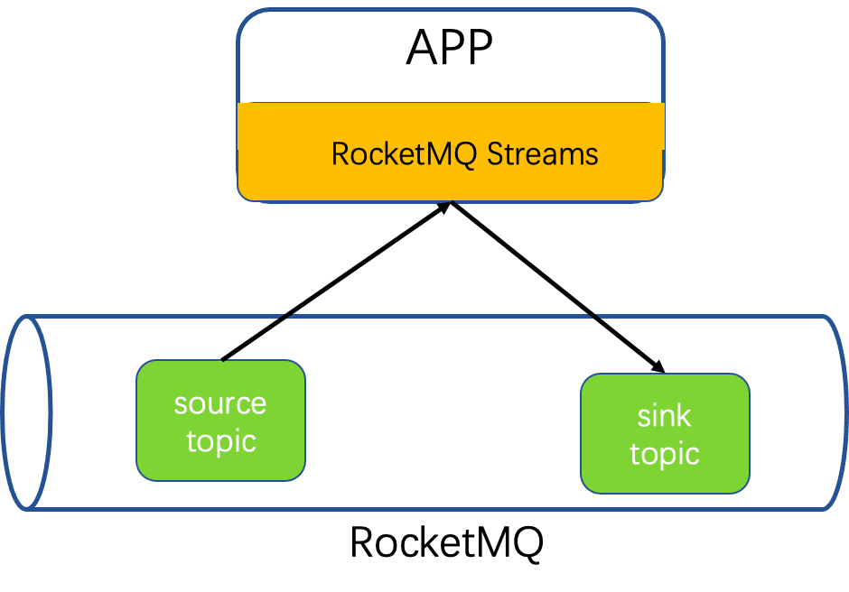
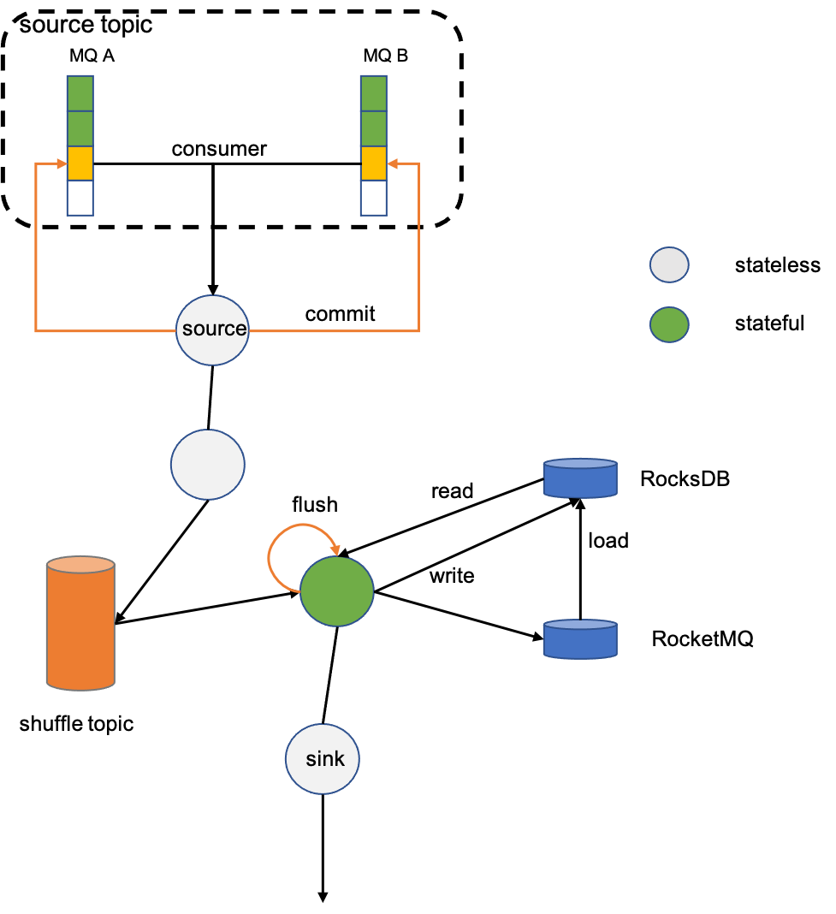
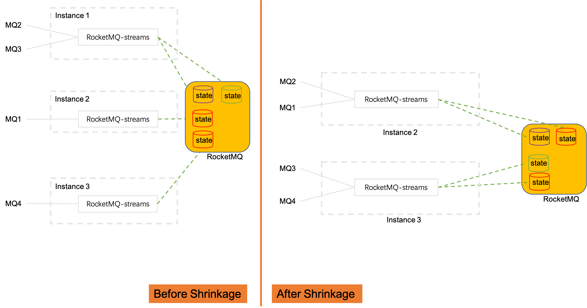

# RocketMQ Streams overview

RocketMQ Streams is a lightweight stream computing engine based on RocketMQ. It can be applied as an SDK dependency without the need for deploying complex stream computing servers, making it resource-efficient, easily extensible, and rich in stream computing operators.

## Architecture

Data is consumed from RocketMQ by RocketMQ-streams, processed, and ultimately written back to RocketMQ.

Data is consumed by the RocketMQ Consumer, enters the processing topology to be processed by operators. If the stream processing task contains the keyBy operator, the data needs to be grouped by Key and written to a shuffle topic. Subsequent operators consume from the shuffle topic. If there are also stateful operators such as count, the calculation requires reading and writing to the state topic. After the calculation is finished, the result is written back to RocketMQ.

## Consume model

The calculation instances actually depend on the client of the Rocket-streams SDK. Therefore, the calculation instances consume MQ, dependent on the RocketMQ rebalance allocation. The total number of calculation instances cannot be greater than the total number of consuming MQ, otherwise, some calculation instances will be in a waiting state, unable to consume data.

One calculation instance can consume multiple MQs, and within one instance, there is only one calculation topology graph.

## State

For stateful operators, such as count, grouping must be done first before summing. The grouping operator keyBy will re-write the data to RocketMQ based on the grouping key, and ensures that data with the same key is written to the same partition (this process is called shuffle), to ensure that data with the same key is consumed by the same consumer. The state is locally accelerated by RocksDB, and remotely persisted by RocketMQ.

## Expansion/shrinkage capacity

When the calculation instances are reduced from 3 to 2, with the help of the rebalance function under the RocketMQ cluster consumption mode, the consumed MQ will be re-allocated among the calculation instances. The MQ2 and MQ3 consumed by Instance1 are allocated to Instance2 and Instance3, and the state data of these two MQs also needs to be migrated to Instance2 and Instance3. This also implies that the state data is saved according to the original data partition MQ; expansion is just the opposite process.
